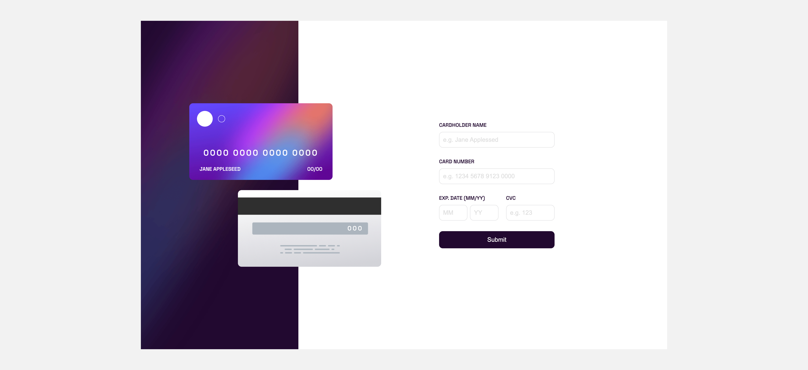

# Frontend Mentor - Interactive card details form solution

This is a solution to the [Interactive card details form challenge on Frontend Mentor](https://www.frontendmentor.io/challenges/interactive-card-details-form-XpS8cKZDWw)

## Table of contents

- [The challenge](#the-challenge)
- [Screenshot](#screenshot)
- [Links](#links)
- [Built with](#built-with)
- [Useful resources](#useful-resources)
- [Author](#author)

## The challenge

Users should be able to:

- Fill in the form and see the card details update in real-time
- Receive error messages when the form is submitted if:
  - Any input field is empty
  - The card number, expiry date, or CVC fields are in the wrong format
- View the optimal layout depending on their device's screen size
- See hover, active, and focus states for interactive elements on the page

## Screenshot

## Links

- Solution URL: [https://github.com/iflucian/interactive-card-details-form](https://github.com/iflucian/interactive-card-details-form)
- Live Site URL: [https://iflucian.dev/practice/interactive-card-details-form/](https://iflucian.dev/practice/interactive-card-details-form/)

## Built with

- Semantic HTML5 markup
- CSS custom properties
- Flexbox
- CSS Grid
- Mobile-first workflow

## Useful resources

- [JavaScript Client-side Form Validation - Florin Pop](https://www.youtube.com/watch?v=rsd4FNGTRBw&t=315s)

## Author

- Website - [Lucian](https://www.iflucian.dev)
- Frontend Mentor - [@iflucian](https://www.frontendmentor.io/profile/iflucian)
